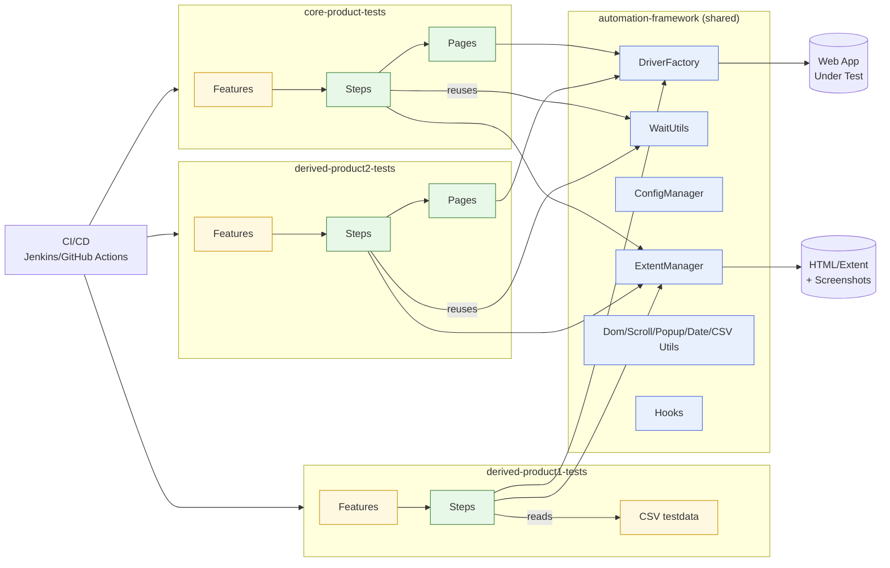
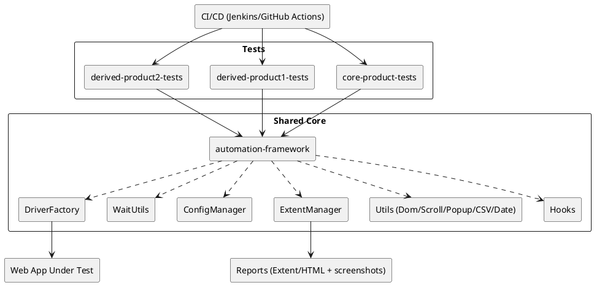

# Framework Architecture Diagrams

> GitHub can render **Mermaid** directly in Markdown. A PlantUML version is also provided for PNG generation.

---

## 1) High-Level System (Mermaid)



---

## 2) Dependency Direction (Mermaid)

```mermaid
graph TD
  CP[core-product-tests] --> AF[automation-framework]
  DP1[derived-product1-tests] --> AF
  DP2[derived-product2-tests] --> AF
  AF --> RPT[reports (Extent/HTML)]
```

---

## 3) PlantUML Component View



**Render PlantUML to PNG (example via Docker):**
```bash
docker run --rm -v "$PWD":/work plantuml/plantuml -tpng ARCHITECTURE.puml
```
